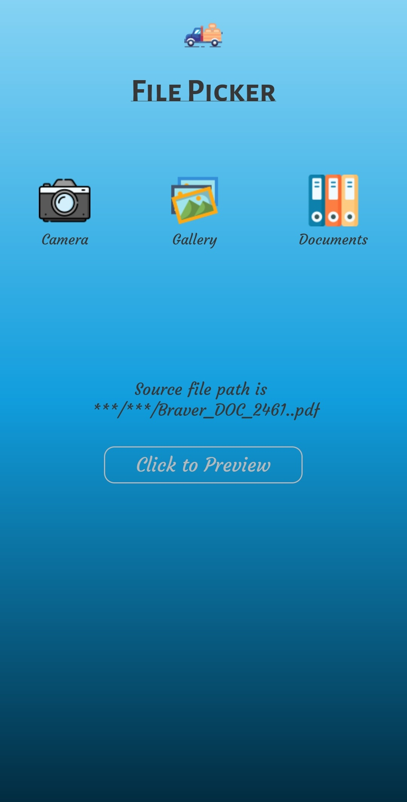

# Android FilePicker

# Description

This app can make the file picking process easy, which allows you to select Pictures, Videos, and Documents. Also, that has Capturing Photo/Video option.
For using this library, you need to migrate your project to AndroidX(If your project is not migrated to AndroidX).





# Getting Started

To add this library to your project, please follow below steps

Add this in your root `build.gradle` file (project level gradle file):

```gradle
allprojects {
    repositories {
        maven { url "https://www.jitpack.io" }
    }
}

buildscript {
    repositories {
        maven { url "https://www.jitpack.io" }
    }	
}
```

Then, Add this in your root `build.gradle` file (app level gradle file):

  add implementation 'implementation 'com.github.braver-tool:Android11FilePicker:0.1.1' to your build.gradle dependencies block.
  
  for example:
  
  ```
  dependencies {
    implementation 'com.github.braver-tool:Android11FilePicker:0.1.1'
  }
  ```

# Key Features :

- Fully Handled Android's Dangerous Permissions
- Compressing option for selected images included,
- To Preview your selected images using 'PhotoView'
- To Preview your selected videos using exoplayer

This library compatible with Android 6 and above


## Version Compatibility
It depends on your targetAPI:
- `targetAPI <= 28`, you are fine ;)
- `targetAPI >= 29`, please enable `requestLegacyExternalStorage` on your Manifest.xml file

## How to use the included SD-card picker:

### Include a provider element

Due to changes in Android 6.0 Marshmallow, bare File URIs can no
longer be returned in a safe way. This change requires you to add an
entry to your manifest.

**NOTE: If you have an existing content provider in your app with the same authority you will have a conflict.**

```xml
    <provider
            android:name="androidx.core.content.FileProvider"
            android:authorities="${applicationId}.provider"
            android:exported="false"
            android:grantUriPermissions="true">
            <meta-data
                android:name="android.support.FILE_PROVIDER_PATHS"
                android:resource="@xml/provider_paths"
                tools:replace="android:resource" />
        </provider>
```

## Permissions Needed :

* android.permission.READ_EXTERNAL_STORAGE
* android.permission.CAMERA
* android.permission.RECORD_AUDIO

### Include the camera activity

**NOTE: The theme set in the manifest is important.

```xml
    <activity
       android:name="com.braver.tool.picker.CameraActivity"
       android:label="@string/app_name"
         android:theme="@style/Theme.FilePicker">
    </activity>
```

### Handling the ActivityResult

You can use the included utility method to parse the activity result:

```java
 activityResultLauncherForGallery = registerForActivityResult(new ActivityResultContracts.StartActivityForResult(), result -> {
            if (result.getResultCode() == RESULT_OK && result.getData() != null) {
             Uri selectedMediaUri = result.getData().getData();
             File imageFile = new BraveFilePicker().setActivity(PickerActivity.this).setIsCompressImage(false).setIsTrimVide(false).setFileType(BraveFileType.IMAGE).setDestinationFilePath(AppUtils.getRandomImageFileName(PickerActivity.this)).setContentUri(selectedMediaUri).getSourceFile();
             // Do something with the result...
            }
        });
```

## Want to customize further?

Sample project is here(https://github.com/braver-tool/Android11FilePicker)

## Usage

 * Photoview - ImageView for Android that supports zooming, by various touch gestures.
   https://github.com/Baseflow/PhotoView
