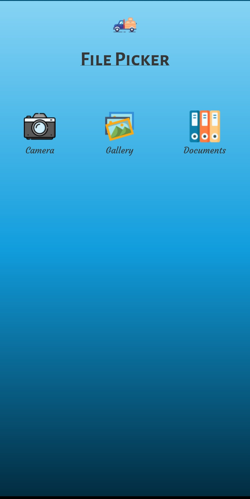

# Android FilePicker

# Description

This app can make the file picking process easy, which allows you to select Pictures, Videos, and Documents. Also, that has Capturing Photo/Video option.
For using this library, you need to migrate your project to AndroidX(If your project is not migrated to AndroidX).





# Getting Started

To add this library to your project, please follow below steps

Add this in your root `build.gradle` file (project level gradle file):

```gradle
allprojects {
    repositories {
        maven { url "https://www.jitpack.io" }
    }
}

buildscript {
    repositories {
        maven { url "https://www.jitpack.io" }
    }
}
```

Then, Add this in your root `build.gradle` file (app level gradle file):

  add implementation 'implementation 'com.github.braver-tool:Android11FilePicker:0.1.1' to your build.gradle dependencies block.

  for example:

  ```
  dependencies {
    implementation 'com.github.braver-tool:Android11FilePicker:0.1.1'
  }
  ```

# Key Features :

- Fully Handled Android's Dangerous Permissions
- Compressing option for selected images included,
- To Preview your selected images using 'PhotoView'
- To Preview your selected videos using exoplayer

This library compatible with Android 6 and above


## Version Compatibility
It depends on your targetAPI:
- `targetAPI <= 28`, you are fine ;)
- `targetAPI >= 29`, please enable `requestLegacyExternalStorage` on your Manifest.xml file

## Permissions Needed :

* android.permission.READ_EXTERNAL_STORAGE
* android.permission.CAMERA
* android.permission.RECORD_AUDIO